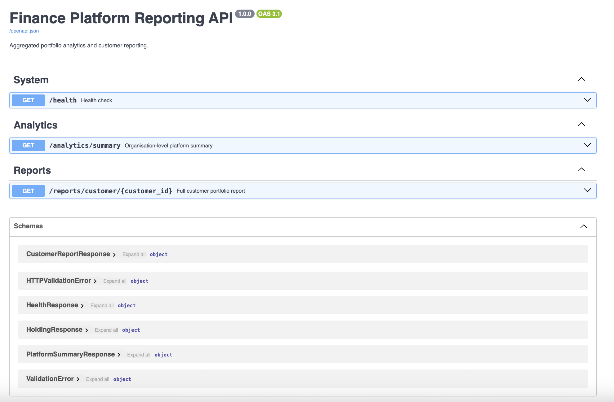
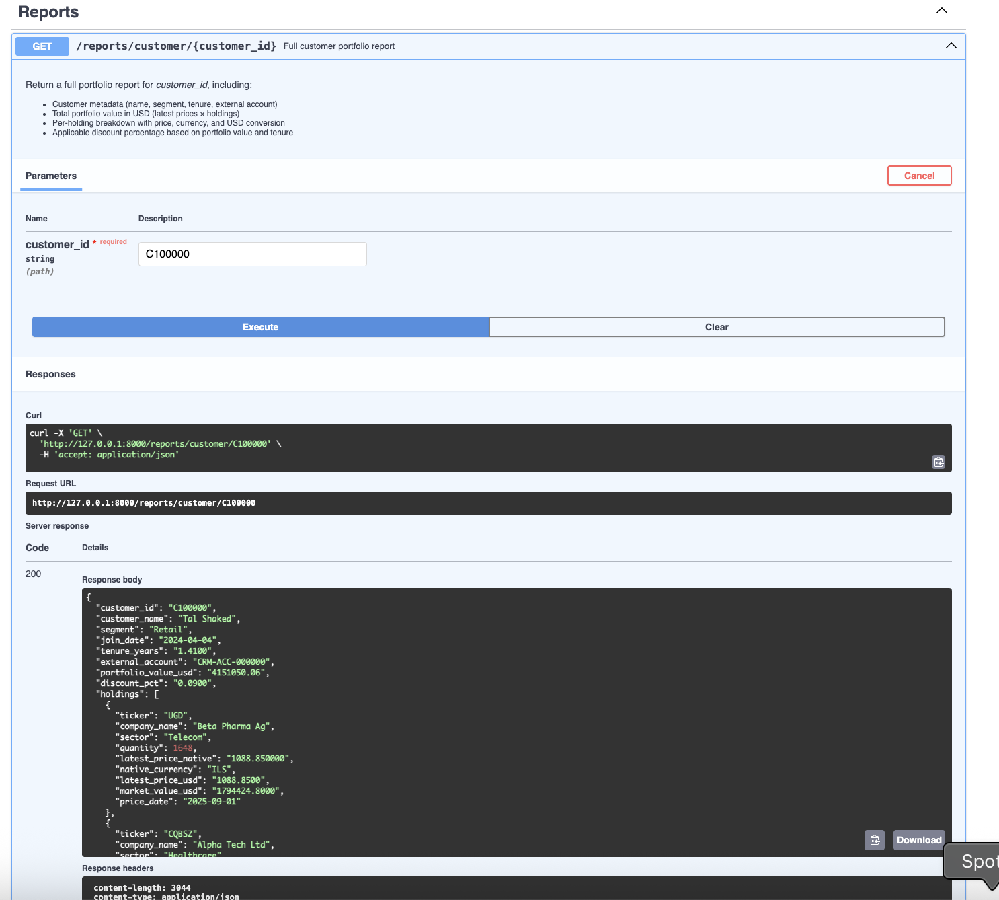

# Design Document: Data Insights & Reporting Platform

**Author:** Tal Chausho Gur Arie | **Version:** 1.0 | **Date:** March 2026

---

## 1. Summary

This platform is a POC designed to pull data from multiple sources (CSV, API, DB), validate it, and provide unified reporting.

**Main Goals:**

* **Multi-source Ingestion:** Handling more than just flat files.
* **Early Validation:** Catching bad data before it hits the DB.
* **USD Normalization:** Converting all currency values to USD based on historical dates.
* **Reporting API:** Exposing metrics via FastAPI for easy consumption.

---

## 2. Key Assumptions

* **Data Consistency:** All sources (CSV, API, DB) map to a standard dictionary format during ingestion.
* **Historical Accuracy:** Currency normalization uses the FX rate from the **date of the price/trade**.
* **Fallback Logic:** If an FX rate is missing for a specific date, the system uses the most recent available rate.
* **Infrastructure:** SQLite is used for POC, with an easy switch to PostgreSQL via the ORM.
* **Error Tolerance:** Row-level failures are logged while valid data is committed.

---

## 3. Architecture & Tech Stack

### High-Level Layers:

1. **Ingestion Layer:** Provider Pattern abstracts data sources.
2. **Storage Layer:** Relational DB managed via SQLAlchemy 2.0.
3. **Analytics Layer:** Business logic, FX matching, and discounts.
4. **API Layer:** FastAPI endpoints.

### Tech Stack:

* **Python 3.12**, **SQLAlchemy 2.0**, **Pydantic v2**, **FastAPI**.

---

## 4. Data Flow & Normalization

`Provider.fetch()` → `List[dict]` → `Pydantic Validation` → `SQLAlchemy ORM` → `Database Transaction`.

---

## 5. Data Modeling

8 tables including Core (`Customer`, `Trade`, `HoldingSnapshot`), Reference (`StockMaster`, `PriceHistory`, `FxRateUSD`), and Logic (`DiscountRule`).

---

## 6. Resilience & Error Handling

* **Validation:** Pydantic handles cleanup and type enforcement.
* **Atomic Transactions:** Batch commits with rollback on fatal errors.

---

## 7. Visual Interface Examples (POC)

### API Documentation Overview

To demonstrate the system's interface, the following screenshot shows the auto-generated Swagger UI. This allows for quick testing of the Ingestion, Analytics, and Reporting endpoints:

### Sample Portfolio Report (Customer C100000)

The following is an example of a JSON response for a specific customer from the provided CSV data. It demonstrates how the system aggregates holdings and normalizes values to USD:

---

## 8. Future Roadmap

* **Scale:** PostgreSQL + Alembic + Upserts.
* **Automation:** Celery background tasks.
* **Production Ready:** OAuth2, Redis caching, and Sentry.

---

## 9. Running Locally

1. `pip install -r requirements.txt`
2. `python main.py --serve`
3. View docs at: `http://localhost:8000/docs`
